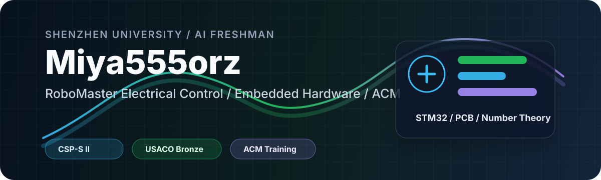

<div align="center">
  
</div>

<h1 align="center">Hi, I'm Miya Zheng</h1>

<p align="center">
  AI student at Shenzhen University · RoboMaster hardware/control · embedded robotics learner
</p>

<p align="center">
  <a href="https://www.cnblogs.com/Miya555">Blog</a>
  &nbsp;·&nbsp;
  <a href="https://www.luogu.com.cn/user/764982">Luogu</a>
  &nbsp;·&nbsp;
  <a href="https://github.com/Miya555orz">GitHub</a>
</p>

<p align="center">
  
  
  
  
</p>

---

## About Me

I am an Artificial Intelligence student at Shenzhen University, currently learning embedded control through real hardware instead of only simulations.

My favorite kind of engineering is where algorithms, circuits, firmware, and mechanical structure finally meet on a moving robot.

```text
Current direction   wheel-leg robots / STM32 / FOC / CAN / UART / IMU
Competition track   RoboMaster electrical control and hardware
Algorithm side      ACM training, number theory, combinatorics
Working style       build small, test early, debug from real signals
```
<a href="https://ghfind.com/u/miya555orz?ref=badge"></a>
## What I Am Building

| Project | What It Is | Status |
| --- | --- | --- |
| Mini wheel-leg robot | STM32H723 controller, STS servos, CAN FOC motors, MPU6050 | hardware bring-up |
| MiyaFOC | STM32F103 based hub motor FOC driver | UART/CAN control testing |
| CAN test boards | Minimal STM32 CAN experiments for debugging transceivers and timing | working notes |
| Hardware practice | PCB design, power tree, connectors, signal integrity checks | ongoing |

## Toolbox

| Area | Tools |
| --- | --- |
| Embedded | STM32, Keil MDK, CubeMX, UART, CAN, PWM, timers |
| Hardware | Altium Designer, JLC EDA, soldering, board bring-up |
| Control | PID, basic LQR, IMU attitude estimation, motor feedback |
| Programming | C, C++, Python |
| Mechanical | SolidWorks, robot structure reading and assembly |
| Workflow | Git, GitHub, VS Code, lab notes |

## Algorithm Background

| Track | Notes |
| --- | --- |
| Competitive programming | ACM training |
| Awards | CSP-S provincial second prize, USACO Bronze |
| Favorite topics | Number theory, combinatorics |
| Main language | C++ |

## Current Focus

- Write cleaner embedded C by hand and understand every peripheral I use.
- Finish the mini wheel-leg robot from board bring-up to stable standing.
- Keep algorithm training as a long-term foundation.
- Turn debugging notes into reusable project documentation.

## Contact

| Platform | Link |
| --- | --- |
| Blog | <https://www.cnblogs.com/Miya555> |
| Luogu | <https://www.luogu.com.cn/user/764982> |
| GitHub | <https://github.com/Miya555orz> |

<div align="center">
  <sub>Build honestly. Debug patiently. Learn in public.</sub>
</div>
